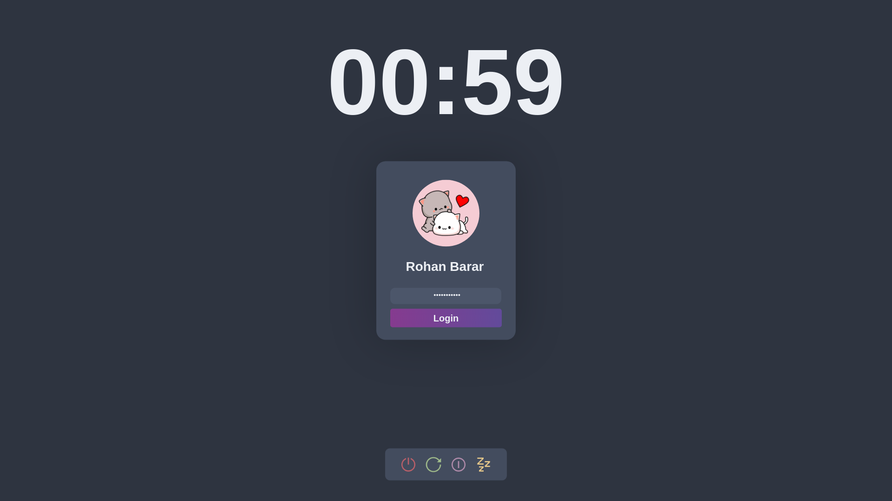

# SlateGreet
A minimalistic greeter based on [lightdm-gab-nord](https://github.com/AlphaNecron/lightdm-gab-nord).

## Installation
* Install [Nody Greeter](https://github.com/JezerM/nody-greeter).
* Clone this repository to `/usr/share/web-greeter/themes/`.
* Enable the theme in your `/etc/lightdm/web-greeter.yml` by replacing `theme: gruvbox` with `theme: SlateGreet`.

## Screenshot

